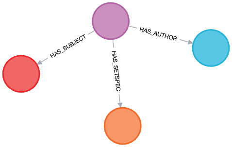

## 1. Introduction

This project is an academic endeavor aimed at harvesting records from the ArXiv API, specifically the OAI-PHM endpoint. It comprises two main modules: `api_worker` and `harvest_and_collect`. The `api_worker` module provides a Flask application for interacting with a Neo4j database that stores ArXiv records, while the `harvest_and_collect` module provides classes to connect to and harvest records from the ArXiv database and add them to a Neo4j database.


## 2. Table of Contents
- [1. Introduction](#1-introduction)
- [2. Table of Contents](#2-table-of-contents)
- [3. Prerequisites](#3-prerequisites)
- [4. Features](#4-features)
- [5. Project Overview](#5-project-overview)
  - [5.1. api\_worker Module](#51-api_worker-module)
  - [5.2. harvest\_and\_collect Module](#52-harvest_and_collect-module)
    - [5.2.1. Classes in harvest\_and\_collect Module](#521-classes-in-harvest_and_collect-module)
- [6. Python Documentation](#6-python-documentation)
- [7. API Documentation](#7-api-documentation)
  - [7.1. How to use the POST Method](#71-how-to-use-the-post-method)
- [8. Database](#8-database)
- [9. Getting Started](#9-getting-started)
  - [9.1. Environment Configuration](#91-environment-configuration)
    - [9.1.1. Presets :](#911-presets-)
      - [9.1.1.1. Mocking the response from ArXiv settings:](#9111-mocking-the-response-from-arxiv-settings)
      - [9.1.1.2. Requesting the records from ArXiv settings:](#9112-requesting-the-records-from-arxiv-settings)
      - [9.1.1.3. Requesting the cs records from 2023 until now from ArXiv settings:](#9113-requesting-the-cs-records-from-2023-until-now-from-arxiv-settings)
- [10. Running Unit Tests](#10-running-unit-tests)
- [11. CI/CD](#11-cicd)
- [12. License](#12-license)

## 3. Prerequisites

This project was developed and tested with Python 3.12, and use Flask 3.0.1.

However, every thing, including tests, can be run through a Docker container that will take care of all the dependancy.
You only need a working version of [Docker](https://www.docker.com/get-started) and [Docker Compose](https://docs.docker.com/compose/install/).

## 4. Features

This project offers the following features:

- Harvesting records from the ArXiv API.
- Storing and managing records in a Neo4j database.
- Querying the database through a Flask application.
  
- Dockerized application for easy setup and deployment.
- Unit tests for each module.
- CI/CD pipelines configured for GitLab.

- Comprehensive API documentation using OpenAPI and Swagger.

## 5. Project Overview

This project consists of two main modules: `api_worker` and `harvest_and_collect`.

It is part of an academic project, where we need to harvest records from the ArXiv API, here the OAI-PHM endpoint.

### 5.1. api_worker Module

The `api_worker` module provides a Flask application for interacting with a Neo4j database that stores ArXiv records. The application provides several endpoints for querying the database:

- `/authors`: Returns a list of all authors in the database.
- `/article/<id>`: Returns the details of the article with the given identifier.
- `/summary/<id>`: Returns the summary of the article with the given identifier.
- `/records`: Returns a list of record identifiers. This endpoint accepts optional query parameters for filtering the records.

The application also provides a POST endpoint at `/records` for adding a new record to the database. The record must be provided as an XML string in the request body.

### 5.2. harvest_and_collect Module

The `harvest_and_collect` module provides classes to connect to and harvest records from the ArXiv database and add them to a Neo4j database.

#### 5.2.1. Classes in harvest_and_collect Module

- `ArXivHarvester`: A class to handle the connection to the ArXiv database and fetch records.
- `ArXivRecord`: A class to represent a single record from the ArXiv database.
- `GraphDBConnexion`: Handle the database connection and provides functions to easily add records to it.

## 6. Python Documentation

Detailed documentation for this project can be found in the `documentation` folder. You can access it via the following URL:
- [harvest-and-collect](documentation/harvest-and-collect.md)
- [api-endpoint](documentation/api-endpoint.md)

## 7. API Documentation

This project uses OpenAPI and Swagger for API documentation. After running the application, you can access the API documentation at `localhost:5000`. Simply navigate to `localhost:5000` in your web browser to view the Swagger UI and interact with the API documentation.

This web interface even allow you to run basic tests of the differents routes.

You can access a, maybe outdated, offline version here : [api-documentation](documentation/api-documentation.md).

### 7.1. How to use the POST Method

In order to use the POST Method, you will need to send a valid xml formated record.

The harvester is using the OAI-PHM API from arXiv, and as such, is derived from the [OAI-PHM Protocol](https://www.openarchives.org/OAI/openarchivesprotocol.html).

The required record format is a little more forgiven but is formatted as such, and requires at least this fields :

```xml
<OAI-PMH xmlns="http://www.openarchives.org/OAI/2.0/" xmlns:xsi="http://www.w3.org/2001/XMLSchema-instance" xsi:schemaLocation="http://www.openarchives.org/OAI/2.0/ http://www.openarchives.org/OAI/2.0/OAI-PMH.xsd">
  <record>
    <header>
      <identifier>oai:arXiv.org:1004.3609</identifier>
 <!-- <datestamp>2021-03-22</datestamp> : Optional, ignored -->
      <setSpec>cs</setSpec>
    </header>
    <metadata>
      <oai_dc:dc xmlns:oai_dc="http://www.openarchives.org/OAI/2.0/oai_dc/" xmlns:dc="http://purl.org/dc/elements/1.1/" xmlns:xsi="http://www.w3.org/2001/XMLSchema-instance" xsi:schemaLocation="http://www.openarchives.org/OAI/2.0/oai_dc/ http://www.openarchives.org/OAI/2.0/oai_dc.xsd">
      <dc:title>Mock Title1</dc:title>
      <dc:creator>Mock Creator</dc:creator>
      <dc:creator>Mock Creator2</dc:creator>
      <dc:subject>Mock Subject1</dc:subject>
      <dc:subject>Mock Subject2</dc:subject>
      <dc:description>Mock Description1</dc:description>
      <dc:description>Mock Description2</dc:description>
      <dc:date>2021-03-23</dc:date>
      <dc:date>2021-03-24</dc:date>
      <dc:type>text</dc:type>
 <!-- <dc:identifier>Mock Identifier</dc:identifier> : Optional, ignored -->
      </oai_dc:dc>
    </metadata>
  </record>
</OAI-PMH>
```

*Note: the namespaces* ***are*** *required. Multiple duplicates fields in `metadata` are possible, but only the first one in `header` will be taken into account.*

## 8. Database

This project utilizes Neo4j, a powerful graph database. The primary motivation behind this choice, apart from the learning opportunity it presents, is the inherent ability of graph databases to establish numerous node connections. This feature enables us to create new, resource-efficient routes that might be more resource-intensive in other types of databases.

For instance, we can easily answer queries like "Which authors have collaborated with this particular author?", "What subjects has an author written about?", or "Which subjects are interconnected?".

Please note that the database is not directly exposed. Instead, the API returns a reconstructed JSON, ensuring a clean and structured data output for the end-users.

Each record is stored as a Record node. Instead of having the author's name inside, it is in its separeted Author node, connected to the record with the relation HAS_AUTHOR. The same idea is used for the subjects and the SetSpec. A record can have multiples authors/subjects nodes, and the otherway around.

<p align="center">
    
</p>

## 9. Getting Started

This app is dockerised, in order to avoid the famous "it works on my computer" ! Nonetheless, you can find the `requirements.txt` in the `launch` folder.

In order to launch the app, first navigate to the launch folder :
```bash
cd launch
```
Then build the container image with :
```bash
docker compose build
```
You can then run the composer :
```bash
docker compose up
```
*Note : this command launch it in the foreground. To run the container in the background, run* `docker compose up -d`*.*

Once you're finished with the app, run this command to remove the containers and the network.
```bash
docker compose down
```

### 9.1. Environment Configuration

The application's behavior can be customized through the .env file.  Here's a brief description of each option:

- `NEO4J_URI`: The URI for the Neo4j database. Set this to localhost if running locally.
- `SKIP_HARVEST`: If set to True, the application will skip the harvesting process.
- `MOCK`: If set to True, the application will mock the response from ArXiv.
- `RESUMPTION_TOKEN`: If set to True, the application will use the resumption token from the previous request.
- `FROM_DATE`: The start date for fetching records. Format: YYYY-MM-DD.
- `UNTIL_DATE`: The end date for fetching records. Format: YYYY-MM-DD.
- `SET_CAT`: The category of records to fetch from ArXiv.
  
**If an option is not used, it must be set to False.**

#### 9.1.1. Presets :

##### 9.1.1.1. Mocking the response from ArXiv settings:

Use these settings to mock around 2 500 records from the ArXiv API. It will load the xml responses in `/mock-responses` which are unchanged data from the ArXiV OAI-PHM API.

##### 9.1.1.2. Requesting the records from ArXiv settings:
Use these settings to request records from ArXiv within a specific date range and category.

##### 9.1.1.3. Requesting the cs records from 2023 until now from ArXiv settings:
Use these settings to request `cs` records from ArXiv from 2023 until the current date.

## 10. Running Unit Tests

To run the unit tests for each module, navigate to the module's directory and run the following commands:

```bash
chmod +x run_unit_test.sh
sh run_unit_test.sh
```

*Note: you will find one script of each module, they cannot be run in parrallel.*
*Note: these tests relies on Docker to run. It create a neo4j database without volumes attached, so no data is keep after the tests are run*

It is possible to run the test localy, using the command : 

```bash
docker run -d -p 7474:7474 -p 7687:7687 -e NEO4J_ACCEPT_LICENSE_AGREEMENT=yes -e NEO4J_AUTH=none neo4j:5.15.0-community-bullseye
```

And then in each folder :
```bash
export PYTHONPATH=$PWD
pytest test
```

The database can be keep running between each tests run as it is wipe before the start of each test.

## 11. CI/CD

This repository is hosted on GitLab and mirrored on GitHub. Please note that the CI/CD pipelines are configured for GitLab only.

The CI/CD pipeline includes automatic unit tests and linting verification. The linting verification are allowed to fail as to not block the release of new versions.

We have implemented a continuous development approach. Certain push to the `main` branch triggers an automatic release, such as `fix` and `feat`. We adhere to the Semantic Versioning standards, facilitated by the use of Conventional Commits.

*Fun fact: more than 460 jobs where runned on the GitLab runner of CentraleSupelec, 90 just to get the Semantic Versioning working.*

You can find the releases [here](https://gitlab-student.centralesupelec.fr/thomas.robertson/arxiv-api-extraction/-/releases), along with their changelogs. They are automatically generated by the CI/CD Pipeline, and the changelog is generated by the semantic-release app.


## 12. License

This project is licensed under the MIT License. See the [LICENSE](LICENSE) file for details.